Raspberry Pi ADS-B Base Station for OpenSky Network
===================================================

# Introduction

This guide explains how to assemble a simple ADS-B base station using Raspberry Pi and cheap off-the-shelf components
and how to connect your station to the [OpenSky Network](https://opensky-network.org/).

The proposed base station will be able to receive and decode transponder signals from planes in the radius of up to 200-300 km.

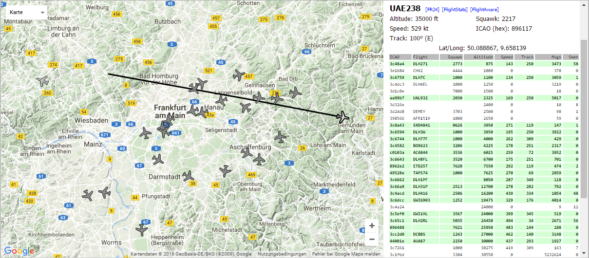

You will also be able to feed your data into [OpenSky Network](https://opensky-network.org/) and other networks and use it in local applications like [PlanePlotter](http://www.coaa.co.uk/planeplotter.htm).

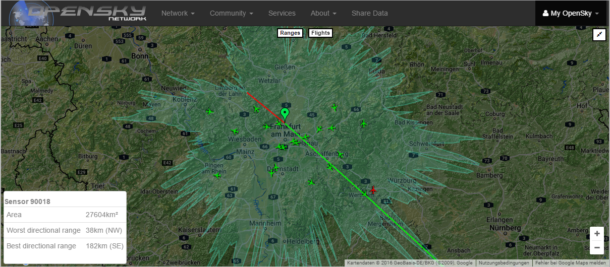

Instructions below are based on the [ADS-B using dump1090 for the Raspberry Pi](http://www.satsignal.eu/raspberry-pi/dump1090.html) guide.

This guide assumes installation in a home network with internet connection via router like FRITZ!Box.

# Prerequisites

* The most important prerequisite is place with clear view of the sky where you could place the antenna.
* If you want to feed your data into [OpenSky Network](https://opensky-network.org/), you must be able to open and forward ports on your router.
* [OpenSky Network](https://opensky-network.org/) needs a static host name or IP address to connect to your base station.
If you don't have a static IP address (you normally don't), your router must support dynamic DNS using a provider like [No-IP.com](http://www.noip.com/).
* Your router must support WiFi so that you could connect Raspberry Pi to the network wirelessly.

# Shopping list

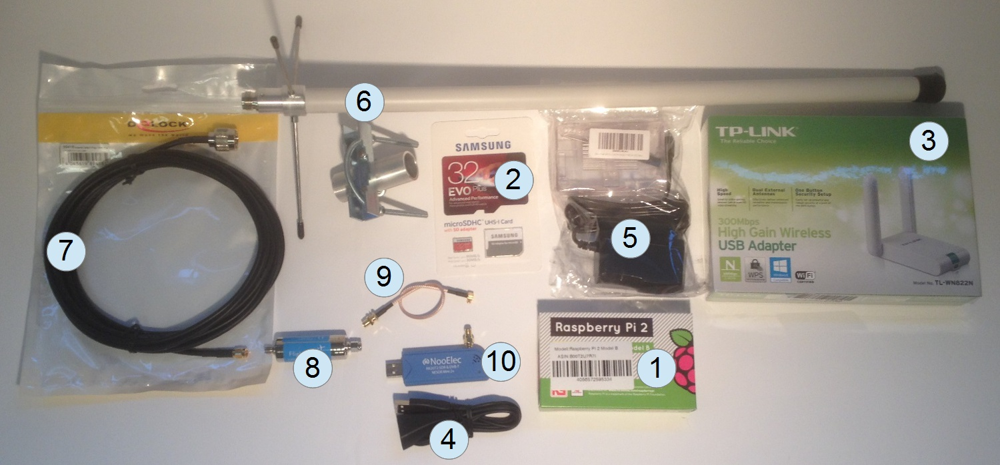

* Raspberry Pi set
  * (1) Raspberry Pi 2 Model B [amazon.de](https://www.amazon.de/dp/B01CPGZY3O)
  * (2) Memory Card 32GB MicroSDHC Class 10, SD adapter [amazon.de](https://www.amazon.de/dp/B01CPGZY3O)
  * (3) WLAN Adapter [amazon.de](https://www.amazon.de/gp/product/B00416Q5KI)
  * (4) USB extension cable [amazon.de](https://www.amazon.de/dp/B000NWS55M)
  * (5) Power supply, heatsinks, case [amazon.de](https://www.amazon.de/gp/product/B00UCSO9G6)
* Receiver
  * (6) ADS-B Antenna with *N Female* Connector [ebay.de](http://www.ebay.de/itm/Antenna-ads-b-collinear-great-gain-for-usb-dongle-flightbox-/291800588117)
  * (7) Cable *N Male - SMA Male*  [amazon.de](https://www.amazon.de/gp/product/B0152WWEUO)
  * (8) (Optional) Band-pass Filter *SMA Female - SMA Male* [amazon.de](https://www.amazon.de/gp/product/B010GBQXK8)
  * (9) (Optional) Cable *SMA Female - MCX Male* [amazon.de](https://www.amazon.de/gp/product/B00V4PS1L0)
  * (10) USB RTL-SDR Receiver [amazon.de](https://www.amazon.de/gp/product/B00VZ1AWQA)

We'll assume that you already have a PC with microSD or SD card reader, monitor with HDMI connection and USB keyboard and mouse needed for installation and that you don't have to order the additionally.
  
## Notes on the shopping list

* You will need a 2A power supply for Raspberry Pi.
* Make sure memory card package includes the SD adapter so that you could use this card in a normal PC (which usually has a SD card reader but not the microSD.
* MicroSDHC Class 10 (high speed class) is highly recommended.
* If you connect the receiver to one of the USB port on Raspberry Pi directly, it will cover other ports. You can avoid this using the USB extension cable.
* You'll need a coaxial cable to connect your antenna to your USB RTL-SDR receiver. The shopping list above assumes an antenna with the N Female connector. The recommended [NooElec NESDR Mini 2+](https://www.amazon.de/gp/product/B00VZ1AWQA) receiver has an MCX Female socket, so you basically need to connect MCX Female to N Female. Such cables (*MCX Male - N Male*) are quite rare, a much better option is a *N Male - SMA Male* plus *SMA Female - MCX Male* combination.
* The *N Male - SMA Male* plus *SMA Female - MCX Male* combination also using the [FlightAware band-pass filter](https://www.amazon.de/gp/product/B010GBQXK8) which reduces the noise and increases the number of the processed ADS-B messages. This filter has the *SMA Female* input and *SMA Male* output so it can be inserted between to cables (from antenna and to to receiver). If you want to spare the filter, just connect two cables directly.
* The [band-pass filter](https://www.amazon.de/gp/product/B010GBQXK8) is optional, but it is highly recommended. It drastically increases the number of messages.
* The [NooElec NESDR Mini 2+](https://www.amazon.de/gp/product/B00VZ1AWQA) includes a small *SMA Female - MCX Male* adapter, so you don't necessarily need the *SMA Female - MCX Male* cable. However, if you use the [FlightAware band-pass filter](https://www.amazon.de/gp/product/B010GBQXK8), it is highly recommended to get *SMA Female - MCX Male* cable as well to add flexible connection between the filter and the receiver. Otherwise the filter is connected rigidly into the small MCX socket and as a potential to break it.

# Overview of the installation steps

* Assemble the Raspberry Pi
* Connect the components
* Setup the Raspberry Pi
  * Prepare the SD card with the Raspbian operating system
  * Perform the Raspbian installation
  * Build and install drivers for the RTL-SDR receiver
  * Build and install the `dump1090` decoder
* Connect your base station to the OpenSky Network
  * Set up dynamic DNS for your Raspberry Pi
  * Make the port `30005` port accessible from the internet
  * Create an OpenSky Network account
  * Configure a new sensor in OpenSky Network

# Assemble the Raspberry Pi

* Attach heatsinks to chips
* Fix the Raspberry Pi to the case using screws, close the case

# Connect the components

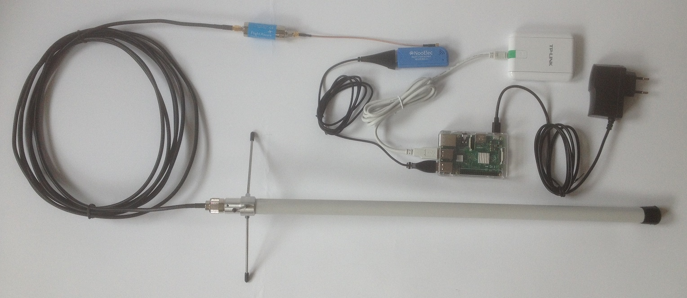

Antenna:

* Antenna *N Female*
* Cable *N Male - SMA Male*
* (Optional) Band-pass filter *SMA Female - SMA Male* 
* (Optional) Cable *SMA Female - MCX Male*, alternatively use the *SMA Female - MCX Male* adapter
* USB RTL-SDR Receiver
* USB extension cable
* ... to Raspberry Pi

WLAN Adapter:

* WLAN Adaper
* USB extension cable
* ... to Raspberry Pi

Also connect keyboard and mouse.

# Set up the Raspberry Pi

## Prepare the SD card with Raspbian operating system for Raspberry Pi

Follow the [NOOBS Setup](https://www.raspberrypi.org/help/videos/) instructions. In short:
* [Download](https://www.sdcard.org/downloads/formatter_4/index.html) and install the SDFormatter (a software to format your microSDHC card).
* Insert your microSDHC memory card into your PC (using the SD adapter).
* Format the microSDHC card using SDFormatter. Make sure you've selected the correct drive letter. Use the options `FORMAT TYPE` `FULL (Erase)` and `FORMAT SIZE ADJUSTMENT` `OFF`.
* [Download](https://www.raspberrypi.org/downloads/noobs/) and unzip NOOBS ("New Out Of the Box Software", an easy operating system installer for Raspberry Pi).
* Copy the uzipped NOOBS files to the freshly formatted microSDHC card.
* Safely eject the memory card.

## Install Raspbian

* Insert the card into Raspberry Pi.
* Connect the power.
* Perform the Raspbian installation.
* Configure the system after installation (you'd typically want to set region and locale and change the default password (`pi`/`raspberry`).
* Set up the WLAN/internet connection.
* Update and upgrade the system:
```
sudo apt-get update
sudo apt-get upgrade
```
* Install `git-core` and `git`:
```
sudo apt-get install git-core git
```

Now your Raspberry Pi is ready to be used.

## Set up RTL-SDR drivers and `dump1090`

### Check out the `raspberry-pi-adsb` project

```
cd ~
git clone https://github.com/openskynetwork/raspberry-pi-adsb.git
chmod +x ~/raspberry-pi-adsb/*.sh
```

### Set up RTL-SDR drivers

Check out, build and install drivers for the RTL-SDR receiver:

```
cd ~/raspberry-pi-adsb
./setup-rtl-sdr.sh
```

You will be prompted to reboot after the set up.

After the system rebooted, you can check the RTL-SDR connection by running:

```
rtl_test
```

You should be seeing something like:

```
Found 1 device(s):
  0:  Realtek, RTL2838UHIDIR, SN: 00000001

Using device 0: Generic RTL2832U OEM
Found Rafael Micro R820T tuner
Supported gain values (29): 0.0 0.9 1.4 2.7 3.7 7.7 8.7 12.5 14.4 15.7 16.6 19.7 20.7 22.9 25.4 28.0 29.7 32.8 33.8 36.4 37.2 38.6 40.2 42.1 43.4 43.9 44.5 48.0 49.6 
[R82XX] PLL not locked!
Sampling at 2048000 S/s.

Info: This tool will continuously read from the device, and report if
samples get lost. If you observe no further output, everything is fine.

Reading samples in async mode...
```

This means RTL-SDR drivers were compiled and installed successfully.

### Set up `dump1090`

[`dump1090`](https://github.com/MalcolmRobb/dump1090) decodes signals coming from the RTL-SDR receiver.

Check out, build and install `dump1090`:

```
cd ~/raspberry-pi-adsb
./setup-dump1090.sh
```
The `setup-dump1090.sh` also installs `dump1090` was as a service so that `dump1090` starts automatically after system restart.

You will be once again prompted to reboot after the set up. 

After the system rebooted, you might want to check if `dump1090` is running correctly. Just go to `http://127.0.0.1:8080` in the browser on Raspberry Pi, you should see a map with planes.

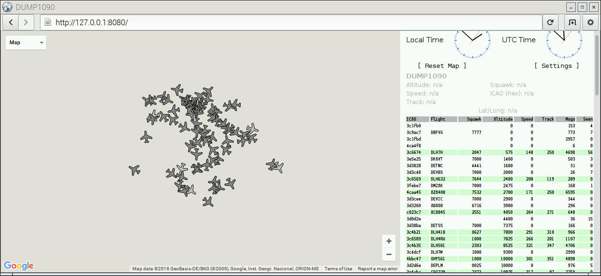

Alternatively, you can start `dump1090` in the interactive mode from the command line. To do this, first stop the running `dump1090` service:

```
sudo /etc/init.d/dump1090.sh stop
```

Now start the `dump1090` in the interactive mode:

```
~/dump1090/dump1090 --interactive --gain -10 --net --net-beast
```

You should be getting output like:

```
Hex     Mode  Sqwk  Flight   Alt    Spd  Hdg    Lat      Long   Sig  Msgs   Ti|
-------------------------------------------------------------------------------
3C4B4C  S                    34000  470  344                      5    39    1
44D076  S                    25000                                4     5    1
3C66B3  S     2037  DLH8YA   19475  339  121   48.916   11.190    4    27    5
040032  S     2540  ETH707    5875  273  119   49.905    8.698    8   113    0
3C6DCD  S     7610           31000  465  108                      4    12    1
44A8A2  S     1000  JAF83X   34625  454  292                      5   130    2
710105  S     2702  SVA116   33000  510  125   49.382    7.167    4   156    1
...
```

Finally, start the `dump1090` service again:

```
sudo /etc/init.d/dump1090.sh start
```

# Connecting your base station to the OpenSky Network

To connect your base station to the OpenSky Network you must make the port `30005` on your Raspberry Pi available from the internet via static host or IP address.

The guide below illustrates configuration on the home network behind the FRITZ!Box 7490 router. I am sorry that the screenshots are in German, I can't easily switch interface language of my router.

## Configure the Raspberry Pi device on your Network

* Give Raspberry Pi a name (I'll use `argon` for example)
* Select "Always use the same IP address"

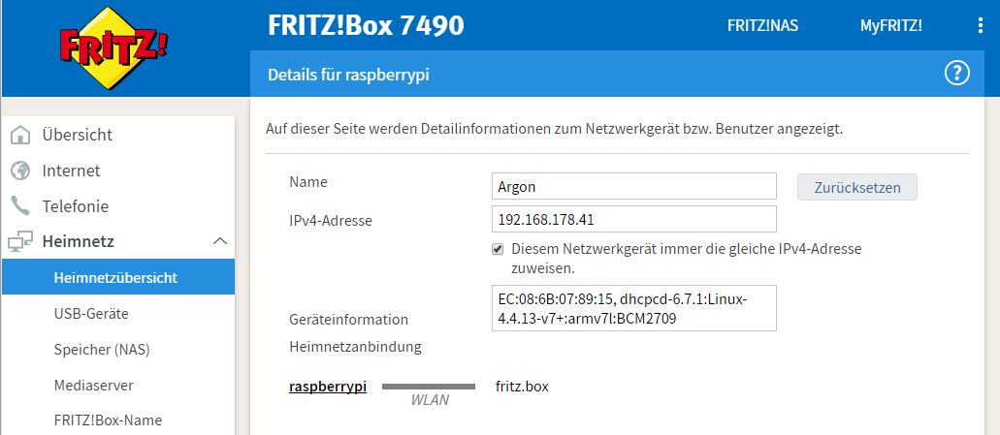

Now you should be able to reach the `dump1090` instance running on the Raspberry Pi via `http://argon:8080`.

You should also be able to connect to the port `30005` (for instance via Putty) and see some binary data coming from the Raspberry Pi.

## Configure dynamic DNS

Condiguring dynamic DNS via provider like [No-IP.com](http://www.noip.com/) will give you a static host name even for dynamically assigned IP addresses.

* Create a [No-IP.com](http://www.noip.com/) account - I'll use `argon-adsb` username for example
* Create a new hostname - I'll use `argon-adsb.ddns.net` for example  
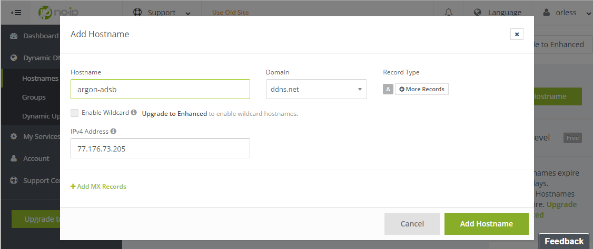
* Configure dynamic DNS in your router  
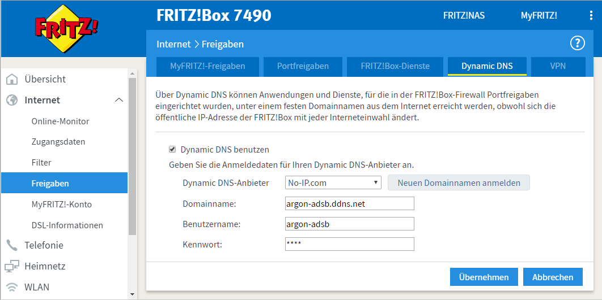

## Configure port forwarding

You will need to make the port `30005` on your Raspberry Pi avaliable from the internet. For this, configure the forwaring of the `30005` to the `argon` host (Raspberry Pi).

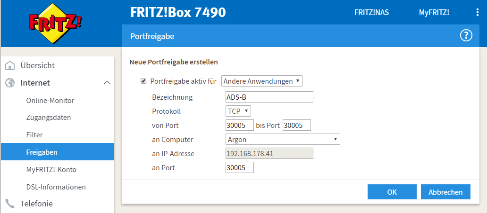

Now you should be able to connect to `argon-adsb.ddns.net:30005` via Putty and see a binary stream coming from `dump1090` on the Raspberry Pi.

Additionally, you can also forward the port `8080` to `argon:8080` so that you could access the web-interface of `dump1090` via `http://argon-adsb.ddns.net:8080`.

## OpenSky Network configuration

* Create an OpenSky Network account
* Add a new sensor: `My OpenSky` > `My Sensors` > `Add Sensor`
* Receiver Type: `dump1090`
* Hostname: `argon-adsb.ddns.net`
* Port: `30005`
* Enter or pick your location
* Submit

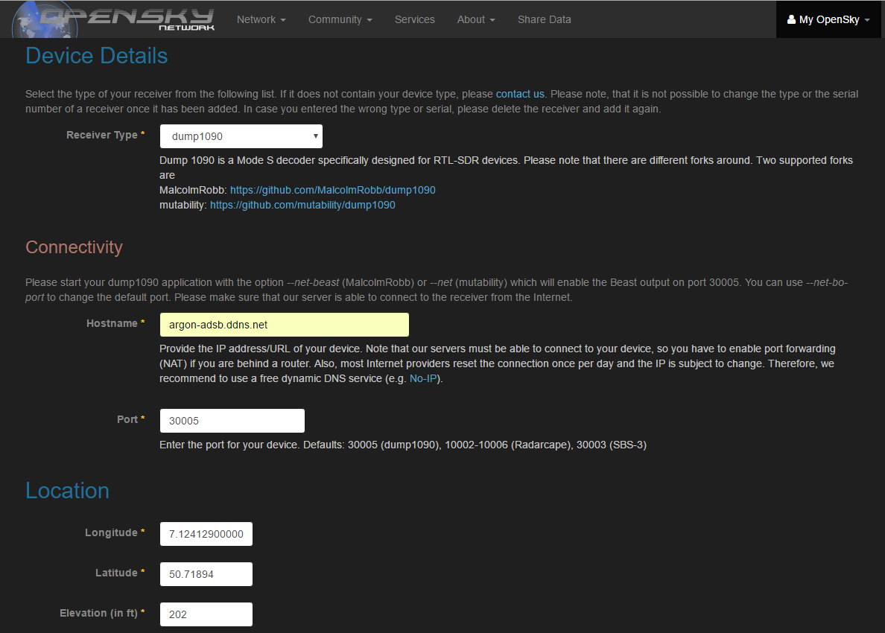

Now you should see your sensor on the map. If everything's fine, the sensor should go online in a couple of minutes.

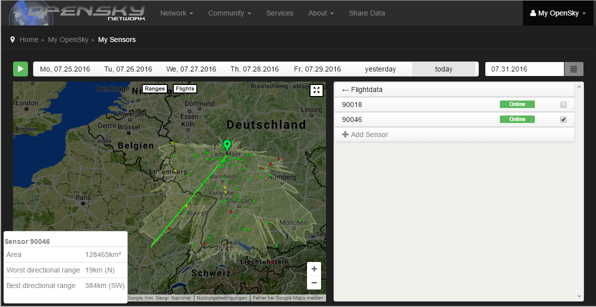

# Credits

* This guide is largely based on the [ADS-B using dump1090 for the Raspberry Pi](http://www.satsignal.eu/raspberry-pi/dump1090.html) guide
* This guide uses RTL-SDR drivers from the [osmocomSDR](http://sdr.osmocom.org/trac/wiki/rtl-sdr) project
* We use the [Malcolm Robb's fork](https://github.com/MalcolmRobb/dump1090) of the [`dump1090`](https://github.com/antirez/dump1090) software

# License

This guide is published under the [MIT license](LICENSE).